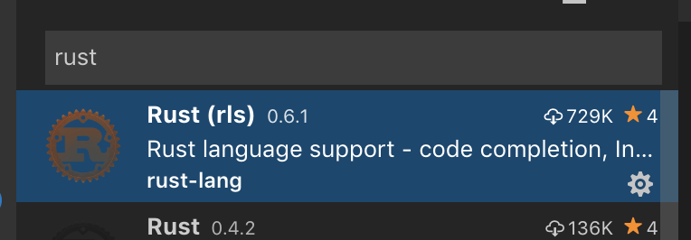

# 0. Setup

## Installation von Rust

### Mit Rustup (Alle Betriebssysteme)

Der Anleitung auf [rustup.rs](https://rustup.rs/) folgen (abhängig vom Betriebssystem)

```bash
rustup component add rustfmt
```

### Über Paketmanager (Linux)

1. Über Package-Manager `cargo` und die `rust-stdlib` installieren

   - Fedora:

   ```bash
   sudo dnf install cargo rust-src rustfmt
   ```

   - Ubuntu:

   ```bash
   sudo apt-get install cargo rust-src
   cargo install rustfmt
   ```

## IntelliJ einrichten

1. In IntelliJ `rust` plugin installieren
2. Plugin konfigurieren: `Languages & Frameworks` -> `Rust`
   - Toolchain location: `/usr/bin`
   - Standard library: `/usr/lib/rustlib/src/rust/src`

## VSCode einrichten (optional)

Rust (rls) extension installieren.

